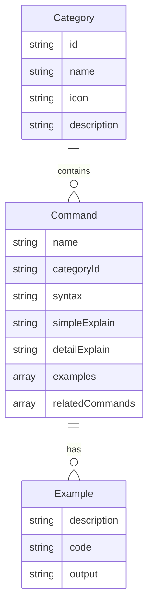

## 1. 架构设计

```mermaid
flowchart TD
    "A[前端 React + Vite]" --> "B[静态命令数据 JSON]"
    "A" --> "C[搜索过滤引擎]"
    "A" --> "D[分类导航组件]"
    "A" --> "E[命令详情组件]"
    "C" --> "B"
    "D" --> "B"
    "E" --> "B"
```

纯前端架构，所有命令数据以JSON形式内嵌在前端，无需后端服务和数据库。

## 2. 技术说明
- 前端：React@18 + Tailwind CSS@3 + Vite
- 初始化工具：Vite
- 后端：无
- 数据库：无，使用内嵌JSON数据

## 3. 路由定义
| 路由 | 用途 |
|------|------|
| / | 主页，搜索栏+分类导航+命令列表 |
| /command/:name | 命令详情页，展示命令的完整解释和示例 |

## 4. API定义
无后端API，所有数据为前端静态JSON。

## 5. 服务器架构图
不适用

## 6. 数据模型

### 6.1 数据模型定义



### 6.2 数据定义语言

命令数据以JSON数组形式存储，结构如下：

```typescript
interface Category {
  id: string;
  name: string;
  icon: string;
  description: string;
}

interface Example {
  description: string;
  code: string;
  output?: string;
}

interface Command {
  name: string;
  categoryId: string;
  syntax: string;
  simpleExplain: string;
  detailExplain: string;
  examples: Example[];
  relatedCommands: string[];
}
```

命令分类覆盖10大类：
1. 文件操作（ls, cd, cp, mv, rm, mkdir, touch, find, ln, chmod, chown...）
2. 文本处理（cat, grep, sed, awk, head, tail, sort, uniq, wc, cut, tr, diff, tee...）
3. 进程管理（ps, top, htop, kill, bg, fg, jobs, nohup, nice, renice...）
4. 网络工具（ping, ifconfig, curl, wget, ssh, scp, netstat, ss, nslookup, dig...）
5. 权限管理（chmod, chown, chgrp, sudo, su, umask, acl...）
6. 系统信息（uname, hostname, uptime, free, df, du, who, w, lsb_release...）
7. 磁盘管理（fdisk, mkfs, mount, umount, fsck, blkid, lsblk, df, du...）
8. 压缩解压（tar, gzip, gunzip, bzip2, zip, unzip, xz, 7z...）
9. 用户管理（useradd, userdel, usermod, passwd, groupadd, groupdel, id, whoami...）
10. 软件包管理（apt, yum, dnf, pacman, pip, npm, snap, flatpak...）
